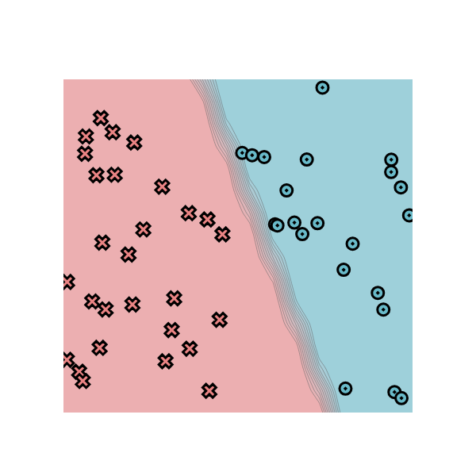
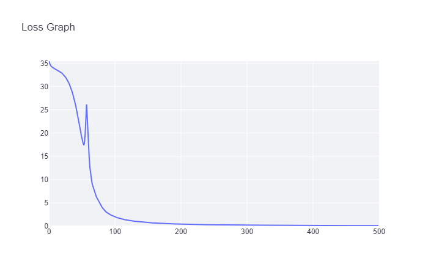
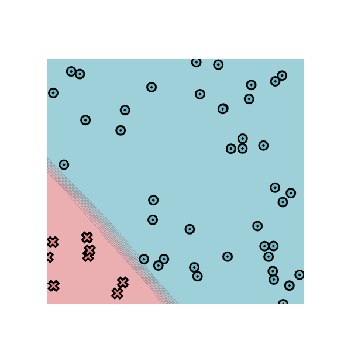
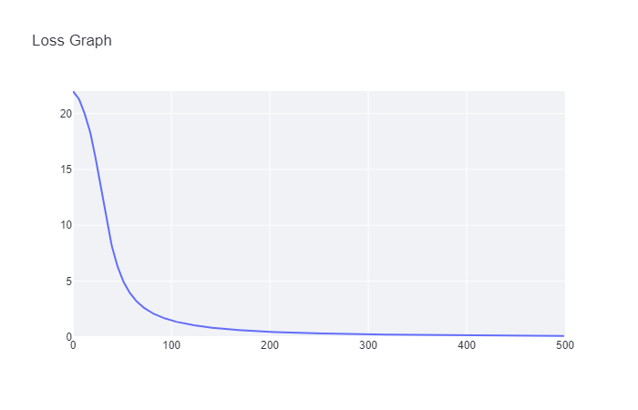
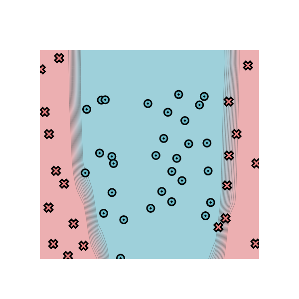
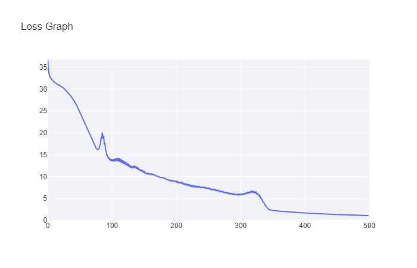
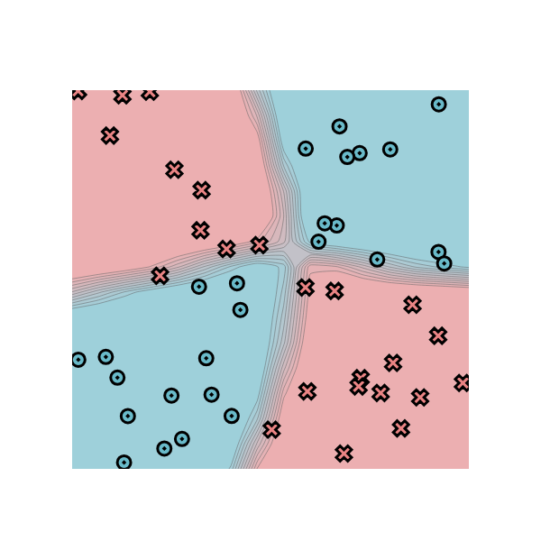
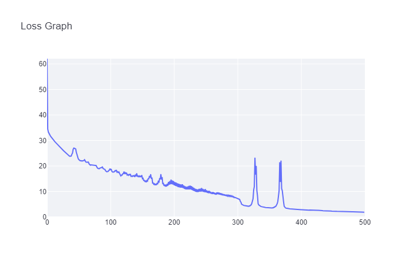

# MiniTorch Module 2


* Docs: <https://minitorch.github.io/>

* Overview: <https://minitorch.github.io/module2/module2/>

## Task 2.5

### Simple Dataset

Parameters

```py
PTS = 50
HIDDEN = 2
Learning Rate = 0.5
Epoch = 500
```

Log:

```bash
Epoch: 0/500, loss: 0, correct: 0, Time per epoch: 0.000s
Epoch: 10/500, loss: 33.790373690050984, correct: 28, Time per epoch: 0.121s
Epoch: 20/500, loss: 32.91862209378924, correct: 28, Time per epoch: 0.136s
Epoch: 30/500, loss: 31.070189323082673, correct: 36, Time per epoch: 0.139s
Epoch: 40/500, loss: 26.835279619228235, correct: 50, Time per epoch: 0.141s
Epoch: 50/500, loss: 19.50443613320509, correct: 49, Time per epoch: 0.141s
Epoch: 60/500, loss: 20.115241406767197, correct: 41, Time per epoch: 0.141s
Epoch: 70/500, loss: 7.486187818992746, correct: 49, Time per epoch: 0.142s
Epoch: 80/500, loss: 4.394810668528324, correct: 50, Time per epoch: 0.142s
Epoch: 90/500, loss: 2.793622576838193, correct: 50, Time per epoch: 0.142s
Epoch: 100/500, loss: 2.0485504540089994, correct: 50, Time per epoch: 0.142s
Epoch: 110/500, loss: 1.5874112731470529, correct: 50, Time per epoch: 0.142s
Epoch: 120/500, loss: 1.2787586058342577, correct: 50, Time per epoch: 0.142s
Epoch: 130/500, loss: 1.05892779823387, correct: 50, Time per epoch: 0.142s
Epoch: 140/500, loss: 0.8957123239593465, correct: 50, Time per epoch: 0.142s
Epoch: 150/500, loss: 0.7707956330310103, correct: 50, Time per epoch: 0.142s
Epoch: 160/500, loss: 0.6728815725950769, correct: 50, Time per epoch: 0.142s
Epoch: 170/500, loss: 0.5942852433270693, correct: 50, Time per epoch: 0.142s
Epoch: 180/500, loss: 0.5301029551354415, correct: 50, Time per epoch: 0.142s
Epoch: 190/500, loss: 0.4771412205583065, correct: 50, Time per epoch: 0.142s
Epoch: 200/500, loss: 0.43363856475119483, correct: 50, Time per epoch: 0.142s
Epoch: 210/500, loss: 0.39640945718492676, correct: 50, Time per epoch: 0.142s
Epoch: 220/500, loss: 0.3642427449846359, correct: 50, Time per epoch: 0.142s
Epoch: 230/500, loss: 0.3362294424075701, correct: 50, Time per epoch: 0.142s
Epoch: 240/500, loss: 0.31166012534745263, correct: 50, Time per epoch: 0.142s
Epoch: 250/500, loss: 0.28997356006003017, correct: 50, Time per epoch: 0.142s
Epoch: 260/500, loss: 0.2707204294592174, correct: 50, Time per epoch: 0.142s
Epoch: 270/500, loss: 0.2535941982545472, correct: 50, Time per epoch: 0.142s
Epoch: 280/500, loss: 0.23851917361502112, correct: 50, Time per epoch: 0.142s
Epoch: 290/500, loss: 0.22495720256301766, correct: 50, Time per epoch: 0.142s
Epoch: 300/500, loss: 0.21265615952747075, correct: 50, Time per epoch: 0.142s
Epoch: 310/500, loss: 0.2014581438038561, correct: 50, Time per epoch: 0.142s
Epoch: 320/500, loss: 0.19122973968099188, correct: 50, Time per epoch: 0.142s
Epoch: 330/500, loss: 0.1818575265223945, correct: 50, Time per epoch: 0.142s
Epoch: 340/500, loss: 0.17324453662465283, correct: 50, Time per epoch: 0.142s
Epoch: 350/500, loss: 0.16530743328972114, correct: 50, Time per epoch: 0.142s
Epoch: 360/500, loss: 0.15797424432354168, correct: 50, Time per epoch: 0.142s
Epoch: 370/500, loss: 0.15118252800503587, correct: 50, Time per epoch: 0.142s
Epoch: 380/500, loss: 0.14487787874703315, correct: 50, Time per epoch: 0.142s
Epoch: 390/500, loss: 0.13901270172540192, correct: 50, Time per epoch: 0.142s
Epoch: 400/500, loss: 0.13354520206129034, correct: 50, Time per epoch: 0.142s
Epoch: 410/500, loss: 0.12843854633060944, correct: 50, Time per epoch: 0.142s
Epoch: 420/500, loss: 0.12366016337448929, correct: 50, Time per epoch: 0.142s
Epoch: 430/500, loss: 0.11918115839037252, correct: 50, Time per epoch: 0.142s
Epoch: 440/500, loss: 0.11497581966318057, correct: 50, Time per epoch: 0.142s
Epoch: 450/500, loss: 0.11102120145887114, correct: 50, Time per epoch: 0.142s
Epoch: 460/500, loss: 0.10729676984722693, correct: 50, Time per epoch: 0.142s
Epoch: 470/500, loss: 0.10378410076646181, correct: 50, Time per epoch: 0.142s
Epoch: 480/500, loss: 0.10046662165222124, correct: 50, Time per epoch: 0.143s
Epoch: 490/500, loss: 0.09732938955007998, correct: 50, Time per epoch: 0.143s
Epoch: 500/500, loss: 0.09435889990581779, correct: 50, Time per epoch: 0.143s
```

Images:





### Diag Dataset

Parameters

```py
PTS = 50
HIDDEN = 5
Learning Rate = 0.5
Epoch = 500
```

Log:

```bash
Epoch: 0/500, loss: 0, correct: 0, Time per epoch: 0.000s
Epoch: 10/500, loss: 22.194423027157438, correct: 42, Time per epoch: 0.127s
Epoch: 20/500, loss: 21.992138023622303, correct: 42, Time per epoch: 0.140s
Epoch: 30/500, loss: 21.983868029250228, correct: 42, Time per epoch: 0.140s
Epoch: 40/500, loss: 21.983510215079292, correct: 42, Time per epoch: 0.141s
Epoch: 50/500, loss: 21.983494676088892, correct: 42, Time per epoch: 0.141s
Epoch: 60/500, loss: 21.983494000756096, correct: 42, Time per epoch: 0.142s
Epoch: 70/500, loss: 21.983493971401177, correct: 42, Time per epoch: 0.142s
Epoch: 0/500, loss: 0, correct: 0, Time per epoch: 0.000s
Epoch: 0/500, loss: 0, correct: 0, Time per epoch: 0.000s
Epoch: 10/500, loss: 20.692867439637343, correct: 42, Time per epoch: 0.329s
Epoch: 20/500, loss: 17.770104683184925, correct: 42, Time per epoch: 0.362s
Epoch: 30/500, loss: 13.025756634148575, correct: 42, Time per epoch: 0.374s
Epoch: 40/500, loss: 8.378576489239455, correct: 48, Time per epoch: 0.379s
Epoch: 50/500, loss: 5.449343628805841, correct: 50, Time per epoch: 0.382s
Epoch: 60/500, loss: 3.8144241696409815, correct: 50, Time per epoch: 0.383s
Epoch: 70/500, loss: 2.846650743496289, correct: 50, Time per epoch: 0.384s
Epoch: 80/500, loss: 2.235460777097118, correct: 50, Time per epoch: 0.386s
Epoch: 90/500, loss: 1.818020872949647, correct: 50, Time per epoch: 0.386s
Epoch: 100/500, loss: 1.5175239087484458, correct: 50, Time per epoch: 0.387s
Epoch: 110/500, loss: 1.2914752902036921, correct: 50, Time per epoch: 0.390s
Epoch: 120/500, loss: 1.116880023306872, correct: 50, Time per epoch: 0.389s
Epoch: 130/500, loss: 0.9771302593158904, correct: 50, Time per epoch: 0.389s
Epoch: 140/500, loss: 0.8634972048059661, correct: 50, Time per epoch: 0.389s
Epoch: 150/500, loss: 0.7697349897243847, correct: 50, Time per epoch: 0.388s
Epoch: 160/500, loss: 0.6909262512001937, correct: 50, Time per epoch: 0.388s
Epoch: 170/500, loss: 0.6240423842837148, correct: 50, Time per epoch: 0.388s
Epoch: 180/500, loss: 0.5667971982493604, correct: 50, Time per epoch: 0.388s
Epoch: 190/500, loss: 0.517425974587053, correct: 50, Time per epoch: 0.388s
Epoch: 200/500, loss: 0.47454596280127187, correct: 50, Time per epoch: 0.387s
Epoch: 210/500, loss: 0.4370648447072005, correct: 50, Time per epoch: 0.387s
Epoch: 220/500, loss: 0.4041090675519612, correct: 50, Time per epoch: 0.387s
Epoch: 230/500, loss: 0.37497486630235294, correct: 50, Time per epoch: 0.386s
Epoch: 240/500, loss: 0.34908937866339873, correct: 50, Time per epoch: 0.386s
Epoch: 250/500, loss: 0.3263628907979253, correct: 50, Time per epoch: 0.386s
Epoch: 260/500, loss: 0.3061676158890699, correct: 50, Time per epoch: 0.387s
Epoch: 270/500, loss: 0.28794482797197873, correct: 50, Time per epoch: 0.386s
Epoch: 280/500, loss: 0.2714838024458654, correct: 50, Time per epoch: 0.386s
Epoch: 290/500, loss: 0.25673284706234545, correct: 50, Time per epoch: 0.386s
Epoch: 300/500, loss: 0.24338434310414234, correct: 50, Time per epoch: 0.386s
Epoch: 310/500, loss: 0.23115789616948945, correct: 50, Time per epoch: 0.386s
Epoch: 320/500, loss: 0.21990824587574542, correct: 50, Time per epoch: 0.386s
Epoch: 330/500, loss: 0.20955799763489716, correct: 50, Time per epoch: 0.386s
Epoch: 340/500, loss: 0.1999941897021203, correct: 50, Time per epoch: 0.386s
Epoch: 350/500, loss: 0.19113666251198286, correct: 50, Time per epoch: 0.386s
Epoch: 360/500, loss: 0.18291439903557855, correct: 50, Time per epoch: 0.386s
Epoch: 370/500, loss: 0.17526695233234063, correct: 50, Time per epoch: 0.385s
Epoch: 380/500, loss: 0.16814874505849883, correct: 50, Time per epoch: 0.385s
Epoch: 390/500, loss: 0.16152833566839536, correct: 50, Time per epoch: 0.385s
Epoch: 400/500, loss: 0.15531486309522205, correct: 50, Time per epoch: 0.385s
Epoch: 410/500, loss: 0.14949643573102497, correct: 50, Time per epoch: 0.385s
Epoch: 420/500, loss: 0.14404774742984622, correct: 50, Time per epoch: 0.385s
Epoch: 430/500, loss: 0.13892123357491518, correct: 50, Time per epoch: 0.385s
Epoch: 440/500, loss: 0.1340941286700404, correct: 50, Time per epoch: 0.385s
Epoch: 450/500, loss: 0.12955718964359186, correct: 50, Time per epoch: 0.385s
Epoch: 460/500, loss: 0.1252555821730203, correct: 50, Time per epoch: 0.386s
Epoch: 470/500, loss: 0.12120399277502497, correct: 50, Time per epoch: 0.386s
Epoch: 480/500, loss: 0.117374906617888, correct: 50, Time per epoch: 0.385s
Epoch: 490/500, loss: 0.11374723366165286, correct: 50, Time per epoch: 0.385s
Epoch: 500/500, loss: 0.11029471107672935, correct: 50, Time per epoch: 0.385s
```

Images:





### Split Dataset

Parameters

```py
PTS = 50
HIDDEN = 15
Learning Rate = 0.3
Epoch = 500
```

Log:

```bash
Epoch: 10/500, loss: 31.691080982496935, correct: 34, Time per epoch: 1.728s
Epoch: 20/500, loss: 30.806200556501167, correct: 34, Time per epoch: 1.904s
Epoch: 30/500, loss: 29.56853823387611, correct: 34, Time per epoch: 1.979s
Epoch: 40/500, loss: 27.79468805133439, correct: 36, Time per epoch: 2.005s
Epoch: 50/500, loss: 25.06151700299167, correct: 38, Time per epoch: 2.029s
Epoch: 60/500, loss: 21.7918792216304, correct: 43, Time per epoch: 2.034s
Epoch: 70/500, loss: 18.40123724153324, correct: 45, Time per epoch: 2.039s
Epoch: 80/500, loss: 16.26055614506216, correct: 44, Time per epoch: 2.036s
Epoch: 90/500, loss: 17.59313528140181, correct: 42, Time per epoch: 2.041s
Epoch: 100/500, loss: 13.957517595500304, correct: 43, Time per epoch: 2.045s
Epoch: 110/500, loss: 14.28797390922603, correct: 43, Time per epoch: 2.047s
Epoch: 120/500, loss: 13.558626075708812, correct: 43, Time per epoch: 2.048s
Epoch: 130/500, loss: 12.521275052462308, correct: 43, Time per epoch: 2.050s
Epoch: 140/500, loss: 12.2559396073383, correct: 43, Time per epoch: 2.052s
Epoch: 150/500, loss: 11.23262687392854, correct: 43, Time per epoch: 2.056s
Epoch: 160/500, loss: 10.63670266213702, correct: 44, Time per epoch: 2.058s
Epoch: 170/500, loss: 10.180333493004504, correct: 44, Time per epoch: 2.059s
Epoch: 180/500, loss: 9.684503207503258, correct: 44, Time per epoch: 2.062s
Epoch: 190/500, loss: 9.143234284562867, correct: 44, Time per epoch: 2.062s
Epoch: 200/500, loss: 8.84479589014002, correct: 45, Time per epoch: 2.062s
Epoch: 210/500, loss: 8.42250660044573, correct: 45, Time per epoch: 2.061s
Epoch: 220/500, loss: 8.00784077010164, correct: 45, Time per epoch: 2.059s
Epoch: 230/500, loss: 7.576836890853231, correct: 46, Time per epoch: 2.059s
Epoch: 240/500, loss: 7.373863339787497, correct: 46, Time per epoch: 2.057s
Epoch: 250/500, loss: 7.209399669135457, correct: 46, Time per epoch: 2.056s
Epoch: 260/500, loss: 6.8907210049269905, correct: 46, Time per epoch: 2.056s
Epoch: 270/500, loss: 6.486986963573017, correct: 46, Time per epoch: 2.055s
Epoch: 280/500, loss: 6.19194119810726, correct: 46, Time per epoch: 2.053s
Epoch: 290/500, loss: 5.786746538606117, correct: 46, Time per epoch: 2.052s
Epoch: 300/500, loss: 5.754844152714071, correct: 46, Time per epoch: 2.051s
Epoch: 310/500, loss: 6.073797387016821, correct: 46, Time per epoch: 2.050s
Epoch: 320/500, loss: 6.279545097489774, correct: 46, Time per epoch: 2.049s
Epoch: 330/500, loss: 5.539397749039735, correct: 46, Time per epoch: 2.049s
Epoch: 340/500, loss: 3.199835305060177, correct: 50, Time per epoch: 2.047s
Epoch: 350/500, loss: 2.281731448658681, correct: 50, Time per epoch: 2.047s
Epoch: 360/500, loss: 2.119221474224976, correct: 50, Time per epoch: 2.046s
Epoch: 370/500, loss: 2.0004903748816574, correct: 50, Time per epoch: 2.052s
Epoch: 380/500, loss: 1.8858344629142223, correct: 50, Time per epoch: 2.056s
Epoch: 390/500, loss: 1.7875120572545327, correct: 50, Time per epoch: 2.058s
Epoch: 400/500, loss: 1.6968689891464552, correct: 50, Time per epoch: 2.062s
Epoch: 410/500, loss: 1.6092161490530434, correct: 50, Time per epoch: 2.063s
Epoch: 420/500, loss: 1.5333780022890637, correct: 50, Time per epoch: 2.065s
Epoch: 430/500, loss: 1.4603894551812222, correct: 50, Time per epoch: 2.067s
Epoch: 440/500, loss: 1.3937435673688061, correct: 50, Time per epoch: 2.070s
Epoch: 450/500, loss: 1.3309825901463896, correct: 50, Time per epoch: 2.074s
Epoch: 460/500, loss: 1.2758956188938348, correct: 50, Time per epoch: 2.076s
Epoch: 470/500, loss: 1.2203724403940246, correct: 50, Time per epoch: 2.077s
Epoch: 480/500, loss: 1.1713316108591105, correct: 50, Time per epoch: 2.077s
Epoch: 490/500, loss: 1.1261678162409432, correct: 50, Time per epoch: 2.078s
Epoch: 500/500, loss: 1.0824842359111009, correct: 50, Time per epoch: 2.078s
```

Images:





### Xor Dataset

Parameters

```py
PTS = 50
HIDDEN = 15
Learning Rate = 0.3
Epoch = 500
```

Log:

```bash
Epoch: 10/500, loss: 31.691080982496935, correct: 34, Time per epoch: 1.728s
Epoch: 20/500, loss: 30.806200556501167, correct: 34, Time per epoch: 1.904s
Epoch: 30/500, loss: 29.56853823387611, correct: 34, Time per epoch: 1.979s
Epoch: 40/500, loss: 27.79468805133439, correct: 36, Time per epoch: 2.005s
Epoch: 50/500, loss: 25.06151700299167, correct: 38, Time per epoch: 2.029s
Epoch: 60/500, loss: 21.7918792216304, correct: 43, Time per epoch: 2.034s
Epoch: 70/500, loss: 18.40123724153324, correct: 45, Time per epoch: 2.039s
Epoch: 80/500, loss: 16.26055614506216, correct: 44, Time per epoch: 2.036s
Epoch: 90/500, loss: 17.59313528140181, correct: 42, Time per epoch: 2.041s
Epoch: 100/500, loss: 13.957517595500304, correct: 43, Time per epoch: 2.045s
Epoch: 110/500, loss: 14.28797390922603, correct: 43, Time per epoch: 2.047s
Epoch: 120/500, loss: 13.558626075708812, correct: 43, Time per epoch: 2.048s
Epoch: 130/500, loss: 12.521275052462308, correct: 43, Time per epoch: 2.050s
Epoch: 140/500, loss: 12.2559396073383, correct: 43, Time per epoch: 2.052s
Epoch: 150/500, loss: 11.23262687392854, correct: 43, Time per epoch: 2.056s
Epoch: 160/500, loss: 10.63670266213702, correct: 44, Time per epoch: 2.058s
Epoch: 170/500, loss: 10.180333493004504, correct: 44, Time per epoch: 2.059s
Epoch: 180/500, loss: 9.684503207503258, correct: 44, Time per epoch: 2.062s
Epoch: 190/500, loss: 9.143234284562867, correct: 44, Time per epoch: 2.062s
Epoch: 200/500, loss: 8.84479589014002, correct: 45, Time per epoch: 2.062s
Epoch: 210/500, loss: 8.42250660044573, correct: 45, Time per epoch: 2.061s
Epoch: 220/500, loss: 8.00784077010164, correct: 45, Time per epoch: 2.059s
Epoch: 230/500, loss: 7.576836890853231, correct: 46, Time per epoch: 2.059s
Epoch: 240/500, loss: 7.373863339787497, correct: 46, Time per epoch: 2.057s
Epoch: 250/500, loss: 7.209399669135457, correct: 46, Time per epoch: 2.056s
Epoch: 260/500, loss: 6.8907210049269905, correct: 46, Time per epoch: 2.056s
Epoch: 270/500, loss: 6.486986963573017, correct: 46, Time per epoch: 2.055s
Epoch: 280/500, loss: 6.19194119810726, correct: 46, Time per epoch: 2.053s
Epoch: 290/500, loss: 5.786746538606117, correct: 46, Time per epoch: 2.052s
Epoch: 300/500, loss: 5.754844152714071, correct: 46, Time per epoch: 2.051s
Epoch: 310/500, loss: 6.073797387016821, correct: 46, Time per epoch: 2.050s
Epoch: 320/500, loss: 6.279545097489774, correct: 46, Time per epoch: 2.049s
Epoch: 330/500, loss: 5.539397749039735, correct: 46, Time per epoch: 2.049s
Epoch: 340/500, loss: 3.199835305060177, correct: 50, Time per epoch: 2.047s
Epoch: 350/500, loss: 2.281731448658681, correct: 50, Time per epoch: 2.047s
Epoch: 360/500, loss: 2.119221474224976, correct: 50, Time per epoch: 2.046s
Epoch: 370/500, loss: 2.0004903748816574, correct: 50, Time per epoch: 2.052s
Epoch: 380/500, loss: 1.8858344629142223, correct: 50, Time per epoch: 2.056s
Epoch: 390/500, loss: 1.7875120572545327, correct: 50, Time per epoch: 2.058s
Epoch: 400/500, loss: 1.6968689891464552, correct: 50, Time per epoch: 2.062s
Epoch: 410/500, loss: 1.6092161490530434, correct: 50, Time per epoch: 2.063s
Epoch: 420/500, loss: 1.5333780022890637, correct: 50, Time per epoch: 2.065s
Epoch: 430/500, loss: 1.4603894551812222, correct: 50, Time per epoch: 2.067s
Epoch: 440/500, loss: 1.3937435673688061, correct: 50, Time per epoch: 2.070s
Epoch: 450/500, loss: 1.3309825901463896, correct: 50, Time per epoch: 2.074s
Epoch: 460/500, loss: 1.2758956188938348, correct: 50, Time per epoch: 2.076s
Epoch: 470/500, loss: 1.2203724403940246, correct: 50, Time per epoch: 2.077s
Epoch: 480/500, loss: 1.1713316108591105, correct: 50, Time per epoch: 2.077s
Epoch: 490/500, loss: 1.1261678162409432, correct: 50, Time per epoch: 2.078s
Epoch: 500/500, loss: 1.0824842359111009, correct: 50, Time per epoch: 2.078s
Epoch: 0/500, loss: 0, correct: 0, Time per epoch: 0.000s
Epoch: 10/500, loss: 30.48965735657122, correct: 35, Time per epoch: 1.705s
Epoch: 20/500, loss: 27.756976267561424, correct: 40, Time per epoch: 1.867s
Epoch: 30/500, loss: 25.26416791018421, correct: 41, Time per epoch: 1.926s
Epoch: 40/500, loss: 24.63029040309282, correct: 39, Time per epoch: 1.956s
Epoch: 50/500, loss: 22.846928445356113, correct: 40, Time per epoch: 1.977s
Epoch: 60/500, loss: 22.45596459425827, correct: 40, Time per epoch: 1.991s
Epoch: 70/500, loss: 20.456258691070808, correct: 40, Time per epoch: 1.999s
Epoch: 80/500, loss: 19.302402269600453, correct: 43, Time per epoch: 2.006s
Epoch: 90/500, loss: 18.885436092631334, correct: 43, Time per epoch: 2.021s
Epoch: 100/500, loss: 18.987817415263617, correct: 41, Time per epoch: 2.033s
Epoch: 110/500, loss: 18.447935994392477, correct: 43, Time per epoch: 2.037s
Epoch: 120/500, loss: 16.968756910826325, correct: 43, Time per epoch: 2.037s
Epoch: 130/500, loss: 16.703891623862027, correct: 43, Time per epoch: 2.039s
Epoch: 140/500, loss: 16.42138179770534, correct: 43, Time per epoch: 2.039s
Epoch: 150/500, loss: 16.449444263503654, correct: 44, Time per epoch: 2.040s
Epoch: 160/500, loss: 15.143468295946068, correct: 44, Time per epoch: 2.045s
Epoch: 170/500, loss: 13.013954152191154, correct: 45, Time per epoch: 2.044s
Epoch: 180/500, loss: 16.811750309835716, correct: 44, Time per epoch: 2.048s
Epoch: 190/500, loss: 13.035695582421205, correct: 44, Time per epoch: 2.050s
Epoch: 200/500, loss: 14.12109026283954, correct: 44, Time per epoch: 2.051s
Epoch: 210/500, loss: 12.857090554481976, correct: 44, Time per epoch: 2.052s
Epoch: 220/500, loss: 11.812080038714287, correct: 44, Time per epoch: 2.051s
Epoch: 230/500, loss: 11.81896150220064, correct: 44, Time per epoch: 2.054s
Epoch: 240/500, loss: 11.021035748552036, correct: 45, Time per epoch: 2.054s
Epoch: 250/500, loss: 10.905085196889502, correct: 45, Time per epoch: 2.054s
Epoch: 260/500, loss: 9.66806241673709, correct: 46, Time per epoch: 2.055s
Epoch: 270/500, loss: 9.666342760759877, correct: 46, Time per epoch: 2.056s
Epoch: 280/500, loss: 8.89302568557282, correct: 46, Time per epoch: 2.056s
Epoch: 290/500, loss: 8.406029629641441, correct: 46, Time per epoch: 2.056s
Epoch: 300/500, loss: 7.4018770987499325, correct: 46, Time per epoch: 2.060s
Epoch: 310/500, loss: 4.6136906277084755, correct: 50, Time per epoch: 2.062s
Epoch: 320/500, loss: 4.330005165652708, correct: 50, Time per epoch: 2.065s
Epoch: 330/500, loss: 20.053834791665288, correct: 42, Time per epoch: 2.067s
Epoch: 340/500, loss: 3.9741381292806364, correct: 50, Time per epoch: 2.068s
Epoch: 350/500, loss: 3.6007475006420657, correct: 50, Time per epoch: 2.068s
Epoch: 360/500, loss: 4.194241910208344, correct: 50, Time per epoch: 2.070s
Epoch: 370/500, loss: 11.140523183988213, correct: 44, Time per epoch: 2.070s
Epoch: 380/500, loss: 3.3263976929260632, correct: 50, Time per epoch: 2.070s
Epoch: 390/500, loss: 3.0360036459228326, correct: 50, Time per epoch: 2.072s
Epoch: 400/500, loss: 2.861097040929133, correct: 50, Time per epoch: 2.073s
Epoch: 410/500, loss: 2.734161571999761, correct: 50, Time per epoch: 2.074s
Epoch: 420/500, loss: 2.7400446304850608, correct: 50, Time per epoch: 2.074s
Epoch: 430/500, loss: 2.6390330887917486, correct: 50, Time per epoch: 2.075s
Epoch: 440/500, loss: 2.4097980679843323, correct: 50, Time per epoch: 2.077s
Epoch: 450/500, loss: 2.325925859051559, correct: 50, Time per epoch: 2.079s
Epoch: 460/500, loss: 2.2227255858813946, correct: 50, Time per epoch: 2.080s
Epoch: 470/500, loss: 2.117820399272218, correct: 50, Time per epoch: 2.080s
Epoch: 480/500, loss: 2.0470407834859596, correct: 50, Time per epoch: 2.079s
Epoch: 490/500, loss: 1.9913438419549245, correct: 50, Time per epoch: 2.079s
Epoch: 500/500, loss: 1.908412334643986, correct: 50, Time per epoch: 2.079s
```

Images:




